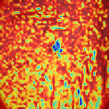
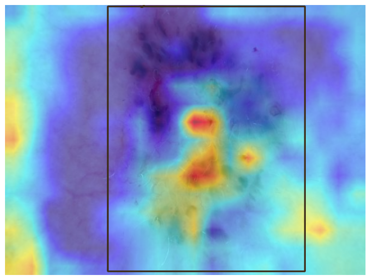
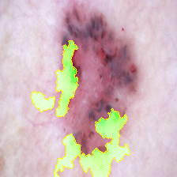
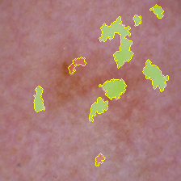

# Explainable AI in Skin Cancer Detection: Comparing CNNs, ViT, and SWIN Transformers

## Introduction
Artificial Intelligence (AI) has revolutionized the field of computer vision, enabling breakthroughs in areas like medical imaging, autonomous vehicles, and more. However, as AI models become more complex, understanding how they make decisions has become increasingly challenging. This is where **AI explainability** comes in—a critical area of research that aims to make AI models more transparent and interpretable.

In this blog post, we explore the explainability of three prominent deep learning architectures **CNNs (YOLOv8)**, **Vision Transformers (ViT)**, and **SWIN Transformers**—in the context of skin cancer detection. Using explainability techniques like **LIME** and **GRAD-CAM**, we compare how well these models can justify their predictions. Whether you're a researcher, developer, or simply curious about AI, this post will provide insights into the trade-offs between model performance and interpretability.

[//]: # (TODO: ADD LINKS TO OG PAPERS)
[//]: # ()
## Background

### What is AI Explainability?
AI explainability refers to the ability of an AI model to provide clear, understandable reasons for its predictions. In certain applications with
In fields like healthcare, explainability is essential for fostering trust among doctors and medical professionals. By providing clear and interpretable insights into how AI models make decisions, explainability helps clinicians understand and validate the reasoning behind predictions. This trust is critical for the successful integration of AI into clinical workflows.

Moreover, AI models have the potential to uncover subtle patterns in medical data that may not be immediately visible to even the most experienced doctors. In the example that we use, in skin cancer detection, AI could identify previously unseen features in dermatological images that correlate with specific conditions. Explainability techniques like LIME and GRAD-CAM allow doctors to visualize these patterns, possibly even bringing to light features that were previously ignored. This would both allow to improve diagnostic accuracy and aid doctors in making more informed decisions.

### The Role of Computer Vision in Medical Imaging
In medical imaging, computer vision models are used to detect diseases, classify conditions, and assist in diagnosis. Skin cancer detection, in particular, has seen significant advancements thanks to deep learning models that can analyze dermatological images with high accuracy.

----
### Models Compared
In this project, we compare three popular deep learning architectures:

#### 1. CNNs (YOLOv8)

Convolutional Neural Networks (CNNs) form the backbone of YOLOv8 by extracting spatial and hierarchical features from images. The core components of CNNs used in YOLOv8 include:

- **Convolutional Layers** – Apply filters to detect edges, textures, and patterns at different levels.
- **Activation Functions** – Use non-linearity (ReLU) to enhance feature learning.
- **Pooling Layers** – Reduce dimensionality while retaining important features.
- **Batch Normalization** – Normalizes activations to stabilize training and improve convergence.
- **Residual Connections** – Improve gradient flow, making training more efficient.

YOLOv8 follows a modular design consisting of three main components:  

##### **a. Backbone (Feature Extraction)**  
The backbone is responsible for extracting useful features from the input image. YOLOv8 uses:  
- **CSPDarkNet53** – A deep CNN with CSP connections to reduce redundancy and enhance efficiency.  
- **C2f (CSP2-Factorized)** – Optimizes feature reuse and improves training stability.  
- **Spatial Pyramid Pooling-Fast (SPPF)** – Captures multi-scale features with minimal computational cost.  

##### **b. Neck (Feature Fusion)**  
The neck aggregates and refines feature maps from different layers for better object detection. It consists of:  
- **Path Aggregation Network (PANet)** – Enhances the flow of spatial and semantic information across layers.  
- **BiFPN (Bi-directional Feature Pyramid Network)** – Efficiently merges low- and high-level features, improving small object detection.  

##### **c. Head (Prediction & Decoding)**  
The prediction head is responsible for detecting objects in the image. Key improvements in YOLOv8 include:  
- **Anchor-Free Detection** – Eliminates predefined anchor boxes, making detection faster and more flexible.  
- **Decoupled Detection Head** – Separates classification and localization tasks, leading to better accuracy.  

#### 1. Vision Transformers (ViTs)  

Vision Transformers (ViTs) are a deep learning architecture designed for image recognition tasks, leveraging the **self-attention mechanism** instead of convolutions to process visual data. Unlike CNNs, which extract features using spatial hierarchies, ViTs **divide an image into fixed-size patches** and process them as a sequence of tokens.  

The core components of ViTs include:  

- **Patch Embedding Layer** – Splits an image into small patches and embeds them into vector representations.  
- **Position Embeddings** – Adds spatial information to maintain positional relationships between patches.  
- **Multi-Head Self-Attention (MHSA)** – Captures global dependencies between image regions.  
- **Feedforward Network (FFN)** – Applies transformations and non-linearities to enhance feature learning.  
- **Layer Normalization & Residual Connections** – Stabilizes training and improves gradient flow.  

ViTs follow a modular design consisting of three main components:  

##### **a. Patch Embedding & Tokenization**  
Instead of using convolutions, ViTs split an image into **fixed-size patches** and flatten them into 1D sequences. Key steps include:  
- **Linear Projection** – Each patch is projected into a high-dimensional embedding space.  
- **Class Token** – A special learnable token is added to the sequence to represent the entire image.  
- **Positional Encoding** – Injects spatial information into the model since self-attention lacks inherent locality.  

##### **b. Transformer Encoder (Feature Extraction)**  
The core of ViTs is the **stacked Transformer encoder**, inspired by NLP models like BERT. Each encoder block contains:  
- **Multi-Head Self-Attention (MHSA)** – Enables the model to capture long-range dependencies between image patches.  
- **Feedforward Network (FFN)** – Applies non-linearity and transformations to enhance learned representations.  
- **Layer Normalization & Residual Connections** – Helps stabilize gradients and improve optimization.  

##### **c. Classification & Output Head**  
After processing through multiple transformer blocks, the model uses the **class token** for final prediction. This step involves:  
- **MLP Head** – A simple fully connected layer that maps the class token representation to output categories.  
- **Softmax Activation** – Converts logits into class probabilities.  

#### 1. Swin Transformers  

Swin Transformers (Shifted Window Transformers) are an advanced vision transformer architecture designed to improve computational efficiency and scalability. Unlike standard Vision Transformers (ViTs), which apply **global self-attention** across the entire image, Swin Transformers introduce **hierarchical feature maps** and **shifted window attention**, making them more suitable for dense vision tasks like object detection and segmentation.  

The core components of Swin Transformers include:  

- **Patch Embedding Layer** – Splits an image into smaller non-overlapping patches and embeds them into vectors.  
- **Hierarchical Feature Maps** – Reduces computational complexity by progressively merging patches into coarser representations.  
- **Shifted Window Multi-Head Self-Attention (SW-MHSA)** – Applies self-attention within **local** windows while allowing cross-window interactions.  
- **Feedforward Network (FFN)** – Enhances feature transformations using non-linearity.  
- **Layer Normalization & Residual Connections** – Stabilizes training and ensures better gradient flow.  

Swin Transformers follow a modular design consisting of three main components:  

##### **a. Patch Embedding & Hierarchical Feature Learning**  
Instead of processing an entire image as a single sequence, Swin Transformers organize patches into a **hierarchical structure**.  
- **Linear Projection** – Converts non-overlapping patches into token embeddings.  
- **Patch Merging** – Gradually merges adjacent patches to reduce sequence length, creating multi-scale feature maps.  
- **Positional Encoding (Relative Position Bias)** – Introduces spatial awareness without requiring fixed positional embeddings.  

##### **b. Swin Transformer Blocks (Feature Extraction)**  
The Swin Transformer stack replaces traditional **global self-attention** with **Shifted Window Self-Attention (SW-MHSA)** to enhance efficiency.  
- **Window-Based Multi-Head Self-Attention (W-MHSA)** – Computes self-attention within non-overlapping local windows to reduce complexity.  
- **Shifted Window Mechanism** – Introduces a **window-shifting step** in alternating layers, allowing information exchange between neighboring windows.  
- **Feedforward Network (FFN)** – Applies MLP layers for feature transformation.  
- **Layer Normalization & Residual Connections** – Stabilizes learning and improves model convergence.  

##### **c. Classification & Output Head**  
After processing through Swin Transformer blocks, the model generates hierarchical feature representations that are used for classification or other vision tasks.  
- **Global Average Pooling (GAP)** – Pools feature maps for classification.  
- **Fully Connected Layer (MLP Head)** – Maps the final representation to output categories.  
- **Softmax Activation** – Converts logits into probabilities for classification tasks.  

---

## Explainability Techniques
#### LIME
**LIME (Local Interpretable Model-Agnostic Explanations)** is a popular technique designed to **explain the predictions** of any machine learning model by approximating its behavior with an interpretable surrogate model in a local region. The steps of how it works precisely are given in the following list:

1. **Selecting an Instance for Explanation**
     - LIME explains **one prediction at a time**. Given an input instance \( x \), the goal is to understand why the model predicted a certain output \( f(x) \).
  
  2. **Generating Perturbations**
     - LIME creates **slightly modified versions** of \( x \) by randomly perturbing its feature values. This generates a dataset of perturbed samples \( \{ x_1, x_2, ..., x_n \} \).
  
  3. **Getting Predictions from the Black-Box Model**
     - The original model \( f(x) \) is used to predict outcomes for the perturbed instances, producing predictions \( \{ f(x_1), f(x_2), ..., f(x_n) \} \).
  
  4. **Weighting Perturbed Instances**
     - LIME assigns higher importance to perturbed samples that are **closer** to the original instance \( x \) using a similarity function (e.g., exponential kernel).
  
  5. **Training a Simple Surrogate Model**
     - LIME trains an **interpretable model** (e.g., linear regression, decision tree) on the weighted dataset. This model approximates the local decision boundary of the black-box model.
  
  6. **Generating Explanations**
     - The learned interpretable model is analyzed to understand the contribution of each feature towards the prediction. The output is a **feature importance ranking**, showing which features most influenced the decision.

#### Grad-CAM
**Grad-CAM (Gradient-weighted Class Activation Mapping)** is a technique used to generate visual explanations for the predictions made by Convolutional Neural Networks (CNNs). It highlights the regions of the input image that are most important for the model's decision-making process by leveraging gradients. The steps of how it works precisely are given in the following list:

1. **Selecting the Target Class for Explanation**
   - Grad-CAM explains **which parts of the image contributed most** to a specific class prediction. The target class \( c \) (e.g., a particular object in an image) is selected for visualization.
  
2. **Computing Gradients for the Target Class**
   - Grad-CAM computes the **gradients of the target class score** with respect to the output feature maps of the last convolutional layer in the network. These gradients indicate how important each feature map is for the final decision.
  
3. **Global Average Pooling of Gradients**
   - The gradients are then **pooled globally** (via global average pooling) to obtain a weight for each channel of the feature map. These weights represent the importance of each feature map channel in the decision-making process.
  
4. **Weighted Combination of Feature Maps**
   - The feature maps of the last convolutional layer are **weighted by the computed gradients**, and a weighted sum of these feature maps is created. This provides a class-specific saliency map that highlights the regions important for the target class.

5. **Generating the Class Activation Map**
   - The weighted feature maps are passed through a **ReLU activation function** to obtain the final **Class Activation Map (CAM)**. This CAM is a heatmap that shows which parts of the image had the greatest influence on the model’s decision.

6. **Visualizing the CAM on the Input Image**
   - The **Class Activation Map (CAM)** is superimposed onto the original image to visualize the **regions of the image** that contributed most to the target class prediction. High-intensity regions on the heatmap indicate the most influential parts of the image for that class.

---

## Methodology
In the next section, we’ll dive into the methodology, including the datasets used, WERE WE GOT  THE MODELS, and how LIME and GRAD-CAM were applied to evaluate explainability. 

### Swin Transformer

The Swin Transformer model used was a model initially trained on the imagenet dataset and later fine-tuned on the **HAM10000 dataset**, which contains **10,015 dermoscopic images** of skin lesions. 
The dataset includes seven diagnostic categories: melanoma, melanocytic nevus, basal cell carcinoma, actinic keratosis, benign keratosis, dermatofibroma, and vascular lesion. 
We transformed these 7 categories into two main categories: Malignant and Benign. 
The Swin Transformer was imported from **Hugging Face**.

- **LIME implementation**: We implemented LIME using the **LIME-Py** library, which provides a simple and intuitive interface for generating explanations. The LIME-Py library allows us to create LIME explainer objects and generate explanations for individual predictions made by the Swin Transformer model.
- **Grad-CAM implementation**: We applied the Grad-CAM technique to the Swin Transformer model using the **PyTorch** library. By extracting the gradients from the final convolutional layer of the Swin Transformer model, we were able to generate class activation maps that highlight the regions of the input image that were most important for the model's predictions.
---

### Dataset

The **HAM10000 dataset**, was compiled to facilitate the development and evaluation of machine learning models for automated skin cancer diagnosis. The dataset's diversity is a key strength, stemming from its collection over 20 years from two geographically separate sources—the Medical University of Vienna and a Queensland skin cancer practice—thereby reflecting real-world clinical variability and enhancing the robustness of trained algorithms. Consequently, HAM10000 has become a benchmark for assessing the performance of both machine learning systems and human experts in skin lesion classification, significantly advancing research in automated skin cancer detection. Due to this we consider this to be an appropriate dataset to test skin cancer explainability for the skin cancer detection task.

Comprising 10,015 dermatoscopic images, it encompasses seven distinct diagnostic categories: 
melanocytic nevi, melanoma, benign keratosis-like lesions, basal cell carcinoma, actinic keratoses, vascular lesions, and dermatofibroma. The dataset offers a variety of fatures:  Each image, identified by image_id and representing a lesion with a unique lesion_id, is accompanied by its imagewidth in pixels. Diagnostic information is provided through dx (specific diagnosis) and dx_type (diagnosis method). Patient demographics include age (numerical), sex (categorical), and localization (lesion location), enhancing the dataset's utility for comprehensive machine learning model development. For this project, only the image and the diagnostic information were utilized. 

This dataset was downloaded from [Huggingface](https://huggingface.co/datasets/marmal88/skin_cancer) where it was uploaded by Daniel Low. 

## Results and Insights

The results have been subdivided into a series of partitions of interest for in depth comparison and analysis. We chose for a set of clearly visible lesion, one with a lesion that is barely visible, as well as results where one method performs better than the other. This is to show whether some methods are better at explaining certain types of images than others.

### Clear Cancer Results
The first results we choose to present partain a classic example of skin cancer where the lesion is clearly visible even to the untrained eye.

| **Image**                  | **Original** | **CNN (YOLOv8)**                               | **ViT**         | **Swin Transformer**                                     |
|----------------------------|--------------|------------------------------------------------|------------------|----------------------------------------------------------|
| Example Image 53 Grad-CAM  |  |   |  |              |
| Example Image 53 LIME      |  |      |  |   |
| Example Image 104 Grad-CAM |  |  |  |             |
| Example Image 104 LIME     |  |     |  |  |

As can be seen in the table above, the models and explainers behave very different in the different scenarios.
We chose these two images to highlight the important differences between the models and explainers. 
We chose a picture containing more hair and a picture with no hair, to see if the models would be able to still explain the differences properly, and not simply based on noise.

The first image already shows clear divergence, especially in the Grad-CAM, it cleary distinguishes the lesion from the rest of the skin, while the other models also detect other areas as explanation. This is supported by the LIME explanation of this image, where it clearly distinguishes the lesion. 

The second image shows a similar pattern for the Grad-CAM example, but diverges in the LIME explanation, where it does not clearly marks the lesion from the rest of the skin. 

Furthermore, we can clearly see that the ViT model takes up a larger area as an explanation than the other two models. This can be explained by how the ViT model processes the image, by dividing it into patches, and then processing these patches. This phenomena is especially very clear in the Grad-CAM images, where the Swin and YOLOv8 models have much more detailed areas, that reflect the lesions.

### Unclear Cancer Results
Unclear cancer results refer to images where the cancer lesion is not obviously cancerogenous. These would pose a high degree of difficulty for human doctors and therefore their correct identification by computer vision models could be of great help. Without any detailed technical knowledge we assume the darker area to be the lesion of interest.

| **Image**                  | **Original** | **CNN (YOLOv8)**                            | **ViT**         | **Swin Transformer**                                     |
|----------------------------|--------------|---------------------------------------------|------------------|----------------------------------------------------------|
| Clean Image 208 Grad-CAM |  |  |  |             |
| Clean Image 208 LIME     |  |  |  |  |
| Noisy Image 210 Grad-CAM |  |  |  |             |
| Noisy Image 210 LIME     |  |  |  |  |

Similar to the previous section, two images are chosen that represent two different cases, noisy (hairy) with index 210 and clean with index 208.

When analysing the clean image (208) we can see clear differences between the performance of the explainability methods. Grad-Cam seems to very clearly show the attention hotspots for both YOLOv8 and for ViT. Both pinpoint the left part of the lesion as being an indicator of cancer. Interestingly, ViT seems to also focus very heavily on the right most part of the lesion, where YOLOv8 seems to indicate the countour of the lesion. SWIN seems to struggle to find the correct area of the lesion specifically and also divides its attention towards many other small changes in hue within the image (normal skin variations) This lack of focus for SWIN is to be expected to some extend given the fine grained nature of its attention.

In terms of LIME explenations for the clean image (208), we see that perturbing the model seems that perturbation create many different possible areas of focus for all models. Of interest are how both SWIN and YOLOv8 seem to capture part of the lesion in one of these areas (the previously discussed right lesion also heavily emphasized by ViT with Grad-Cam). Perturbing the image for ViT seems to make it loose any track of where the lesion is exactly, this may be expected due to the general nature of its attention mechanism. 

When analysing the noisy image (210), particularly with Grad-Cam, we see a very similar explenation area from all three models albeit in completely different modalities. YOLOv8 seems to explain the area of interest in a classical way, where the highes attention is drawn to the area of lesion, correctly ignoring all the noise (hair). ViT also highlights the are of interst but in an inverted manner, the attention is drawn to everything else except for the lesion, thus giving a negative demarcation of the area of the lesion. Finally SWIN seems to have some hotspots around some hairs yet finds an area of interest (left most area) that corresponds to the lesion being analysed.

Finally in terms of LIME explenations for the noisy image (210) we see that the perturbation of the image in addition to the inherent noise of hair, completely confuses the models accross the board. Some small overalps with the lesions can be seen, yet no one area demarcates any relevant or substantial portion of the lesion in question.

### One method performs better than the other

| **Image**                  | **Original** | **CNN (YOLOv8)**                               | **ViT**         | **Swin Transformer**                                     |
|----------------------------|--------------|------------------------------------------------|------------------|----------------------------------------------------------|
| Example Image 29 Grad-CAM  |  |   |  |              |
| Example Image 29 LIME      |  |      |  |   |
| Example Image 87 Grad-CAM  |  |   |  |              |
| Example Image 87 LIME      |  |      |  |   |
| Example Image 117 Grad-CAM |  |  |  |             |
| Example Image 117 LIME     |  |     |  |  |

### ONE METHOD TO RULE THEM ALL MUAHAHAHA

## Analysis
(To be added after completing the analysis.)

## Conclusion

## References
- [LIME Paper](https://arxiv.org/abs/1602.04938)
- [GRAD-CAM Paper](https://arxiv.org/abs/1610.02391)
- [YOLOv8 Documentation](https://docs.ultralytics.com/)
- [ViT Paper](https://arxiv.org/abs/2010.11929)
- [SWIN Transformer Paper](https://arxiv.org/abs/2103.14030)
